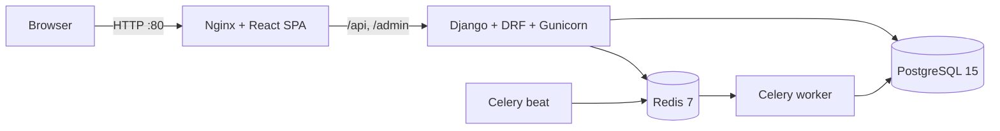

# Green Grid Platform

An energy management platform for a UK-style electricity supplier: smart-meter
ingestion, tariff-aware billing, demand forecasting, anomaly detection and a
customer self-service dashboard.

Built with Django 5 / Django REST Framework and Celery on the backend, and
Vite + React + TypeScript on the frontend. The full stack runs with a single
`docker compose up`.

## Features

- **Billing engine** — generates itemised bills from meter readings and tariff
  assignments. Supports flat and time-of-use tariffs (including rate bands that
  wrap midnight), plus daily standing charges.
- **Demand forecasting** — weighted moving average over a configurable lookback
  window with day-of-week seasonality and confidence intervals, at half-hourly,
  hourly or daily granularity.
- **Anomaly detection** — z-score analysis flags usage spikes and drops, and
  rule-based checks catch reading gaps, flatlined meters and negative values.
  Alerts surface on the customer dashboard.
- **Recommendations** — usage- and tariff-based energy-saving suggestions.
- **CSV meter-reading ingestion** — uploads are validated and bulk-inserted
  asynchronously by a Celery worker, with per-row error reporting.
- **JWT-secured REST API** — SimpleJWT bearer authentication; customers only
  ever see their own data, staff see everything.
- **Customer dashboard** — outstanding balance, month-on-month usage, daily
  consumption chart and recent meter alerts, all driven by the live API.
- **Admin command centre** — Django admin themed with Jazzmin for back-office
  management of customers, meters, tariffs and bills.
- **Stripe payments (test mode)** — bills can be paid through a Stripe
  PaymentIntent flow using test keys. PDF bill download is stubbed and returns
  HTTP 501 unless the optional `xhtml2pdf` dependency is installed.

## Architecture



The backend is organised into focused Django apps:

| App | Responsibility |
| --- | --- |
| `core` | Health check, registration, JWT token endpoints, shared permissions |
| `customers` | Customer accounts, properties and meters (nested REST routes) |
| `metering` | Meter readings, CSV upload + async ingestion pipeline |
| `tariffs` | Tariff plans, time-of-use rate bands, customer assignments |
| `billing` | Bill generation engine, line items, Stripe payments, PDF stub |
| `forecasting` | Demand forecast engine and forecast points |
| `anomalies` | Anomaly detection engine and alert records |
| `recommendations` | Energy-saving recommendation engine |
| `communications` | Email notification helper |

### Celery pipelines

- `metering.tasks.process_readings_upload` — parses an uploaded CSV, validates
  each row and bulk-creates readings.
- `billing.tasks.generate_all_bills_task` — fans out per-customer bill
  generation tasks for a billing period.
- `forecasting.tasks.generate_all_forecasts_task` and
  `anomalies.tasks.detect_all_anomalies_task` — fan out per-meter forecast and
  anomaly scans across all smart meters.

## Quick start (Docker)

```bash
git clone https://github.com/Arshiamk/green-grid-platform.git
cd green-grid-platform

cp .env.example .env          # defaults work for local Docker
docker compose up --build -d  # db, redis, backend, celery worker/beat, frontend
```

Migrations run automatically when the backend container starts. Then seed the
demo dataset so the dashboard has something to show:

```bash
docker compose exec backend python manage.py seed_demo
```

This creates a demo customer with five weeks of half-hourly readings, a
time-of-use tariff, a generated bill, an anomaly scan and a 7-day forecast.
It is idempotent — re-running it resets the demo data.

- **Customer portal**: <http://localhost> — log in with `demo` / `greengrid-demo`
- **Admin**: <http://localhost/admin> — create a superuser first:
  `docker compose exec backend python manage.py createsuperuser`

## API overview

All endpoints are under `/api/` and require a JWT bearer token unless noted.

| Endpoint | Description |
| --- | --- |
| `POST /api/register/`, `POST /api/token/` | Registration and JWT login (public) |
| `GET /health/` | DB + Redis health check (public) |
| `GET /api/customers/` | Customers, with nested `/properties/` and `/meters/` routes |
| `GET /api/metering/readings/` | Meter readings (ordered newest first) |
| `POST /api/metering/upload/` | CSV upload for async ingestion; poll `/api/metering/uploads/` |
| `GET /api/billing/bills/` | Bills with line items |
| `POST /api/billing/generate/` | Generate a bill for a customer + period |
| `POST /api/forecasting/generate/` | Generate a demand forecast for a meter |
| `POST /api/anomalies/detect/` | Run anomaly detection for a meter |
| `GET /api/anomalies/` | Detected anomalies (with `POST .../resolve/` action) |
| `GET /api/recommendations/` | Recommendations (with `POST .../generate/`) |

## Testing

The unit test suite covers the billing, forecasting and anomaly-detection
engines — tariff maths, rate-band matching across midnight, seasonality,
confidence intervals and every anomaly type. Tests run against SQLite, so no
services are needed:

```bash
cd src
DATABASE_URL="sqlite://:memory:" DEBUG=True DJANGO_SECRET_KEY=test \
  python manage.py test
```

On Windows PowerShell:

```powershell
cd src
$env:DATABASE_URL = "sqlite://:memory:"; $env:DEBUG = "True"; $env:DJANGO_SECRET_KEY = "test"
python manage.py test
```

CI (GitHub Actions) runs flake8 and the Django test suite, then lints and
builds the frontend on every push and pull request.

## Local development (without Docker)

```bash
# Backend — requires local Postgres + Redis (docker compose up -d db redis)
cd src
python -m venv .venv && . .venv/Scripts/activate   # or bin/activate on Unix
pip install -r requirements.txt
python manage.py migrate && python manage.py runserver

# Celery worker
celery -A config worker --loglevel=info --pool=solo

# Frontend
cd frontend
npm install && npm run dev   # http://localhost:5173, proxies /api to :8000
```

Windows helper scripts live in `scripts/` (`start.ps1`, `worker.ps1`).

## Tech stack

| Layer | Technology |
| --- | --- |
| API | Django 5, Django REST Framework, SimpleJWT, django-environ |
| Async | Celery 5, Redis 7 |
| Data | PostgreSQL 15 (SQLite for tests) |
| Frontend | Vite, React 18, TypeScript, Tailwind CSS, TanStack Query, Recharts, Framer Motion |
| Admin | Django admin + Jazzmin |
| Infra | Docker Compose (Nginx, Gunicorn), GitHub Actions CI |

## Project structure

```text
green-grid-platform/
├── src/                # Django backend (config + domain apps)
├── frontend/           # React SPA (Vite + TypeScript)
├── scripts/            # Windows dev helper scripts
├── docker-compose.yml  # Full-stack orchestration
├── .github/workflows/  # CI pipeline
└── .env.example        # Environment variable template
```

## License

Distributed under the MIT License. See `LICENSE` for details.
